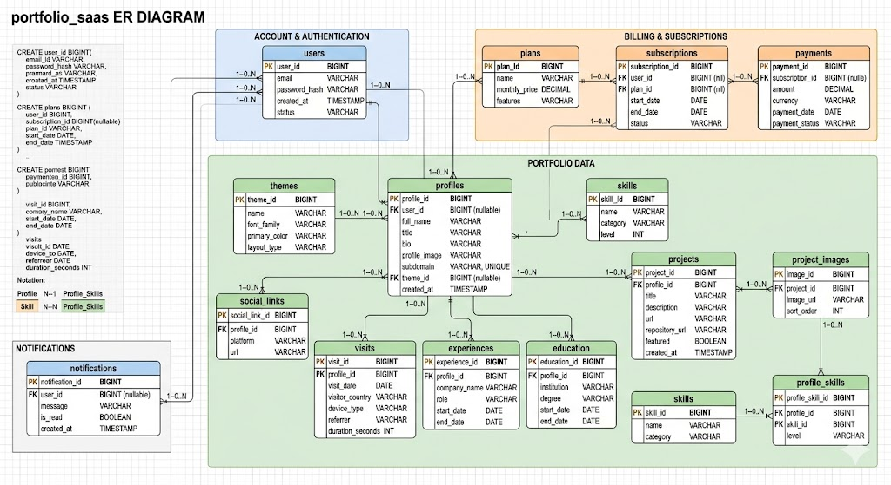

# Proyecto Final — Base de Datos Relacional

## SaaS de portfolios personales bajo subdominio

## 1) Nombre del proyecto

**PortfolioHub SaaS**
*Plataforma multiusuario para creación de páginas de presentación profesional bajo subdominios personalizados.*

Ejemplo:

* `anderson.portfoliohub.com`
* `designer.portfoliohub.com`
* `dev.portfoliohub.com`

---

## 2) Introducción

El proyecto consiste en una aplicación **SaaS (Software as a Service)** orientada a profesionales, freelancers, creativos y estudiantes que desean construir su **sitio de presentación personal** sin necesidad de conocimientos técnicos avanzados.

La plataforma permite:

* crear perfiles profesionales
* publicar experiencia laboral
* mostrar proyectos
* incorporar links de contacto y redes
* administrar plantillas visuales
* gestionar planes de suscripción
* visualizar métricas de visitas

Cada usuario tendrá su página publicada bajo un **subdominio único**.

---

## 3) Objetivo

Diseñar e implementar una base de datos relacional que soporte la operación de una plataforma SaaS multi-tenant.

La solución debe cubrir:

* gestión de usuarios
* autenticación
* administración de perfiles públicos
* almacenamiento de proyectos
* planes de pago
* métricas analíticas
* automatización mediante SP, triggers y funciones
* consultas para reporting

Esto además te permite cubrir la parte **cross-funcional** que menciona la consigna:

* comercial → suscripciones
* analítica → visitas
* operativa → gestión de contenido
* técnica → control de integridad

---

## 4) Situación problemática

Actualmente muchos profesionales necesitan una presencia digital rápida y profesional.

Problemas que resuelve:

* dependencia de redes sociales
* falta de identidad propia
* alto costo de hosting
* dificultad técnica para crear un sitio
* ausencia de analíticas simples

La base de datos centraliza toda esta información permitiendo escalabilidad y mantenimiento.

---

## 5) Modelo de negocio

Modelo SaaS por suscripción.

### Planes posibles

* Free
* Pro
* Premium

### Fuentes de ingresos

* suscripción mensual
* plantillas premium
* dominio personalizado
* estadísticas avanzadas

---
## DER

## Charts
[Website](https://claude.ai/public/artifacts/848afbd1-552c-4dde-8aed-fd6310b1c100)